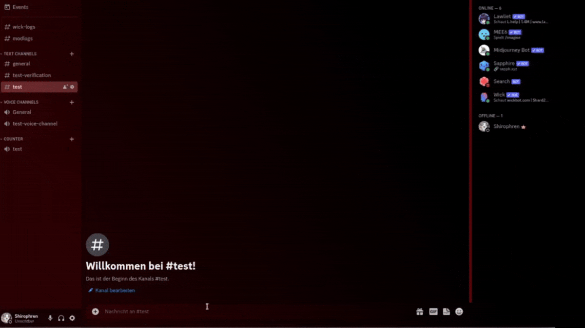

# Table of Content
- [Table of Content](#table-of-content)
- [Description](#description)
- [Installation](#installation)
- [Usage](#usage)
  - [File Uploader](#file-uploader)
  - [Discord Bot](#discord-bot)

# Description

This project is a semantic search engine with a file uploader that allows users to upload PDF files and extracts the content as an embedding and adds metadata to the files for storage in a vector database (qdrant).

The project also includes a Discord bot to facilitate querying the database, and a login and registration feature for users to securely access the file uploader.

# Installation

To install the project, follow these steps:

1. Clone the repository to your local machine.
2. Install `Docker` and `Docker Compose`.
3. Change the keys of `example.env` and save it as `.env`.
4. Run `docker compose up -d`.

# Usage

## File Uploader

To use the File Uploader, follow the steps below:

1. Open your web browser and go to `http://localhost:7000`.
2. Log in at `http://localhost:7000/login`.
3. Click the 'Click to add' button to select a file to upload.
4. Click the 'Upload' button to upload the file.
5. Wait for the upload to complete & 1-2 minutes for the embed to be created.

## Discord Bot

To use the Discord Bot, follow these steps

1. Invite the bot to join your Discord server.
2. Use the `/search` command to query the database.
